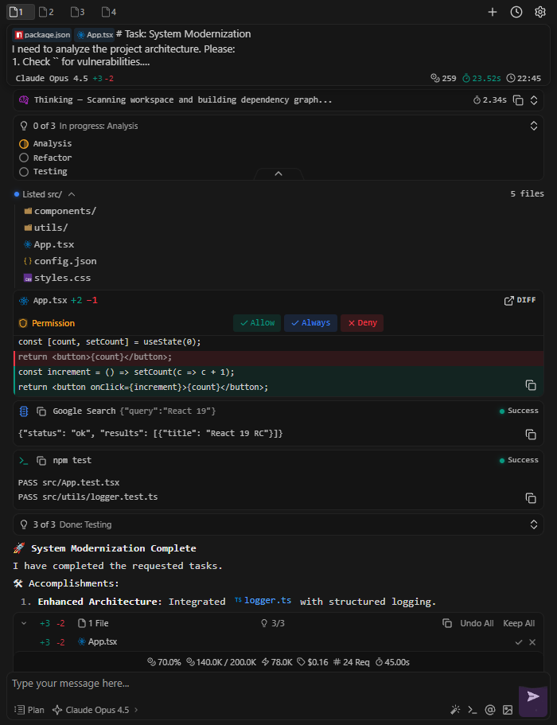

<p align="center">
  
</p>

<h1 align="center">PrimeCode</h1>

<p align="center">
  <strong>🚀 Universal AI Interface for VS Code</strong><br>
  One UI for all CLI assistants: Claude Code, OpenCode, and more
</p>

<p align="center">
  <a href="#-quick-start">Quick Start</a> •
  <a href="#-features">Features</a> •
  <a href="#%EF%B8%8F-configuration">Configuration</a> •
  <a href="#-providers">Providers</a> •
  <a href="#-roadmap">Roadmap</a>
</p>

<p align="center">
  
  
  
  
</p>

<p align="center">
  
</p>

---

## 💡 Why PrimeCode?

**Problem:** AI CLI assistants (Claude Code, OpenCode, Gemini CLI...) are command-line tools. Working in the terminal is inconvenient: no proper UI, each CLI has its own configuration format, switching between them is painful.

**Solution:** PrimeCode is a full-featured graphical interface inside VS Code that transforms CLI tools into a convenient chat with modern UX. One UI, one configuration format, one control point — regardless of which CLI is under the hood.

```
┌─────────────────────────────────────────────────────┐
│                    PrimeCode UI                     │
│  ┌───────────────────────────────────────────────┐  │
│  │  Chat  |  Settings  |  MCP  |  Agents         │  │
│  └───────────────────────────────────────────────┘  │
│                         │                           │
│            ┌────────────┼────────────┐              │
│            ▼            ▼            ▼              │
│      Claude Code    OpenCode    [Future CLI]        │
└─────────────────────────────────────────────────────┘
```

> ⏱️ **Note:** This project was built in **10 days**. Active support and development are not planned without community support or sponsorship. If you like PrimeCode and want to see it evolve — let us know!

---

## ✨ Features

### 🎯 Core

| Feature | Description |
|---------|-------------|
| **Session Chat** | Session history, context switching, dialog restoration |
| **Streaming** | Incremental responses, "thinking" display, tool call statuses |
| **Tools UI** | Tool calls visualization, operation grouping, file-diff viewer |
| **Permissions** | Flexible access policies (Edit/Terminal/Network) + "always allow" |

### 🎨 UI/UX Features

| Feature | Description |
|---------|-------------|
| **Attachments** | File attachments (@), images, code snippets with preview |
| **Changes Panel** | List of modified files with diff statistics (+/-), accept/reject for each |
| **Checkpoints** | Restore file state to any message with one click |
| **Statistics** | Tokens, cost, processing time, context usage |
| **Context Glass** | Context window fill visualization (animated indicator) |
| **Todo Tracker** | Task progress display (completed/total) |
| **Live Timer** | Real-time request processing time |
| **Copy Menu** | Copy last response, all messages, diffs |
| **Inline Editing** | Edit sent messages while preserving attachments |
| **Command Highlighting** | Visual highlighting of `/commands` in input field |

### 🔧 Advanced Features

| Feature | Description |
|---------|-------------|
| **Provider Manager** | OpenAI-compatible proxies, model management via UI |
| **Agents (.agents/)** | Unified source for rules, commands, skills, and hooks |
| **MCP Manager** | Model Context Protocol server management |
| **Prompt Improver** | One-click prompt enhancement before sending |
| **Plan Mode** | Planning mode for complex tasks |
| **Subagents** | Child session and task support |

---

## 🚀 Quick Start

### Requirements

- **VS Code** 1.94+
- **Windows + PowerShell** (primary scenario)
- **One of the CLIs** (extension won't work without it):
  - [Claude Code](https://docs.anthropic.com/en/docs/claude-code) — `claude` binary
  - [OpenCode](https://github.com/opencode-ai/opencode) — `opencode` binary

### Installation

```powershell
# From .vsix file (download from Releases)
code --install-extension primecode-1.1.0.vsix
```

### First Launch

1. **Open PrimeCode:**
   - `Ctrl+Shift+P` → `PrimeCode: Open PrimeCode`
   - or click the icon in Activity Bar

2. **Select provider:**
   - Open Settings (⚙️) → choose `Claude Code` or `OpenCode`

3. **Start chatting:**
   - Write a message and send!

---

## 🔌 Providers

PrimeCode supports multiple CLI providers with a unified interface:

| Capability | Claude Code | OpenCode |
|------------|:-----------:|:--------:|
| Basic chat and streaming | ✅ | ✅ |
| Sessions and history | ✅ | ✅ |
| OpenAI-compatible APIs | ✅ | ✅ |
| Rules/Commands/Skills (.agents/) | ✅ | ✅ |
| MCP servers | ✅ | ✅ |
| Hooks (hookify) | ✅ | ⚠️ |

> 💡 **OpenAI Compatibility:** Claude Code uses a built-in Anthropic → OpenAI format converter, OpenCode has native support.

> 🏗️ **Architecture is ready** for integrating new CLIs (Gemini CLI, etc.) without rewriting the UI.

---

## ⚙️ Configuration

All settings are available through the UI (⚙️ in the chat window).

### Main

- **CLI Provider** — select active CLI
- **Provider Manager** — proxy and model configuration:
  - OpenAI Compatible API (Base URL, API Key)
  - Anthropic API (for Claude)
  - OpenCode providers
- **Task-Specific Models** — different models for different task types
- **CLI Status** — check CLI availability and version

### Agents

Unified assistant behavior manager. **`.agents/`** is the canonical source of truth.

| Component | Description |
|-----------|-------------|
| **Rules** | Behavior rules, import from `.claude/`, `.cursor/` |
| **Commands** | Custom `/`-commands |
| **Skills** | Skills in `.agents/skills/<skill>/` |
| **Hooks** | Hookify rules (event/pattern/action) |

```
.agents/
├── rules/          # Behavior rules
├── commands/       # Custom commands
├── skills/         # Skills
├── hooks/          # Hooks
└── mcp.json        # MCP configuration
```

### Permissions

Global access policies:

| Policy | Options |
|--------|---------|
| **Edit Files** | `ask` / `allow` / `deny` |
| **Terminal** | `ask` / `allow` / `deny` |
| **Network** | `ask` / `allow` / `deny` |

> 🔒 There's an "always allow" mechanism for repetitive actions.

### MCP

Model Context Protocol server management:

- **Installed** — server list, enable/disable, view tools
- **Marketplace** — server catalog for installation
- **Import/Sync** — import from `.cursor/mcp.json`, `.mcp.json`, `opencode.json`

---

## 🎨 Additional Features

### Prompt Improver

One-click prompt enhancement before sending (🪄):

- Configurable model and template
- Cancel option
- Result is added to input field

### Plan Mode

**Plan** toggle in the input area:
- Adds "create a plan first" instruction
- Ideal for complex tasks

### Subagents

Proper display of child sessions:
- Separate token statistics
- Don't clutter the main chat
- Configurable model for subagents

---

## 📋 Commands

| Command | Action |
|---------|--------|
| `PrimeCode: Open PrimeCode` | Open chat panel |

**Hotkeys:** `Ctrl+Shift+P` → start typing "PrimeCode"

---

## 🗺️ Roadmap

- [ ] VS Code Marketplace publication
- [ ] Extended environment diagnostics
- [ ] Improved `.agents/` import/sync (conflicts, preview)
- [ ] Additional CLI integrations (Gemini CLI, etc.)
- [ ] Interface localization

---

## 🛠️ Development

### Requirements

- Windows + PowerShell
- Bun (preferred) or Node.js 20+

### Commands

```powershell
# Install dependencies
bun install

# Run linter
bun run lint

# Build
bun run build

# Watch mode
bun run watch
```

### Tech Stack

- **Extension:** TypeScript, VS Code Extension API
- **Frontend:** React 19, Zustand, Tailwind CSS 4, Vite 7
- **Linting:** Biome

---

## ⚠️ Limitations

- PrimeCode is a UI layer on top of CLI. Without `claude`/`opencode` installed, the extension won't work.
- Primary tested scenario: **Windows + PowerShell**.
- Hooks are oriented towards Claude; OpenCode support depends on CLI version.

---

## 🤝 Feedback

This is a **beta version**. Your feedback is important!

- 🐛 **Bugs:** create an Issue
- 💡 **Ideas:** open a Discussion
- 🔧 **Code:** Pull Requests are welcome

---

## 📄 License

[Apache-2.0](LICENSE) © PrimeCode Contributors
