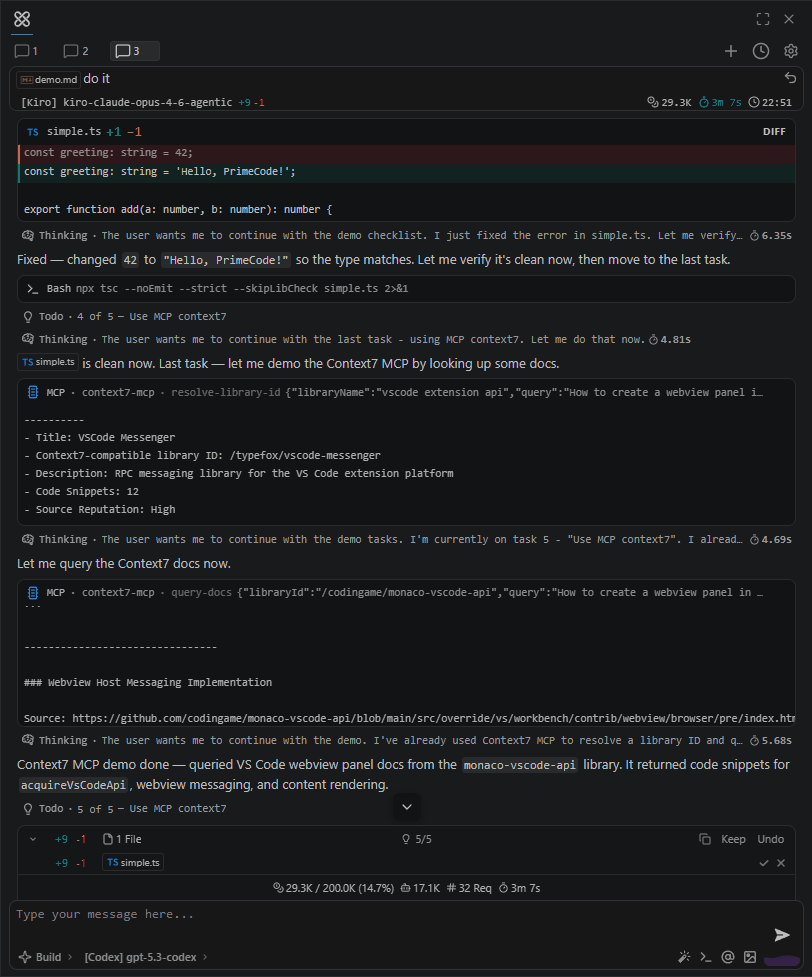

<p align="center">
  
</p>
<h1 align="center">PrimeCode</h1>

<p align="center">
  OpenCode-first AI coding assistant for VS Code<br>
  Full-featured graphical interface for OpenCode CLI
</p>

<p align="center">
  <a href="#-features">Features</a> •
  <a href="#-quick-start">Quick Start</a> •
  <a href="#%EF%B8%8F-configuration">Configuration</a> •
  <a href="#-development">Development</a>
</p>

<p align="center">

  
  
  
</p>

<p align="center">
  
</p>

---

## ✨ Features

<table>
<tr><td colspan="2"><h3>Chat & Streaming</h3></td></tr>
<tr><td><b>Session Chat</b></td><td>Session history, context switching, dialog restoration</td></tr>
<tr><td><b>Multi-Tab Sessions</b></td><td>Work in multiple tabs simultaneously — each with its own session</td></tr>
<tr><td><b>Streaming</b></td><td>Incremental responses, "thinking" display, tool call statuses</td></tr>
<tr><td><b>Tools UI</b></td><td>Tool calls visualization, operation grouping, file-diff viewer</td></tr>
<tr><td><b>Subagents</b></td><td>Child sessions with separate token stats, configurable model</td></tr>
<tr><td><b>Plan Mode</b></td><td>Planning mode toggle — adds "create a plan first" instruction</td></tr>

<tr><td colspan="2"><h3>Editor & Files</h3></td></tr>
<tr><td><b>Attachments</b></td><td>File attachments (@), images, code snippets with preview</td></tr>
<tr><td><b>Changes Panel</b></td><td>Modified files with diff statistics (+/-), accept/reject per file</td></tr>
<tr><td><b>Checkpoints</b></td><td>Restore file state to any message with one click</td></tr>
<tr><td><b>Inline Diff</b></td><td>Added/removed lines in SimpleDiff component</td></tr>
<tr><td><b>Inline Editing</b></td><td>Edit sent messages while preserving attachments</td></tr>
<tr><td><b>Drag & Drop</b></td><td>Files, images, code snippets directly into chat</td></tr>

<tr><td colspan="2"><h3>Intelligence</h3></td></tr>
<tr><td><b>Prompt Improver</b></td><td>One-click prompt enhancement before sending</td></tr>
<tr><td><b>Permissions</b></td><td>16 permission categories with ask/allow/deny + "always allow"</td></tr>
<tr><td><b>Command Highlighting</b></td><td>Visual highlighting of <code>/commands</code> and <code>@subagents</code> in input</td></tr>
<tr><td><b>Slash Commands</b></td><td>Custom <code>/</code>-commands from <code>.opencode/commands/</code></td></tr>

<tr><td colspan="2"><h3>Providers & Models</h3></td></tr>
<tr><td><b>OpenCode CLI</b></td><td>Native integration — sessions, streaming, tools, SSE events</td></tr>
<tr><td><b>Provider Manager</b></td><td>OpenAI-compatible proxies, model management via UI</td></tr>
<tr><td><b>Task-Specific Models</b></td><td>Different models for different task types</td></tr>

<tr><td colspan="2"><h3>Agents & MCP</h3></td></tr>
<tr><td><b>Agents (.opencode/)</b></td><td>Rules, commands, skills, hooks/plugins, subagents</td></tr>
<tr><td><b>MCP Manager</b></td><td>Server management, marketplace, import from <code>.cursor/</code> / <code>.mcp.json</code></td></tr>

<tr><td colspan="2"><h3>Live Stats</h3></td></tr>
<tr><td><b>Session Dashboard</b></td><td>Tokens, cost, elapsed time, context usage, todo progress — all in real time</td></tr>
<tr><td><b>Context Glass</b></td><td>Animated context window fill indicator</td></tr>
<tr><td><b>Copy Menu</b></td><td>Copy last response, all messages, diffs</td></tr>
</table>

---

## 🚀 Quick Start

### Requirements

- **VS Code** 1.105+
- **Windows + PowerShell** (primary scenario)
- [OpenCode](https://github.com/anomalyco/opencode?tab=readme-ov-file#installation) — `opencode` (extension won't work without it)

### Installation

```powershell
# From .vsix file (download from Releases)
code --install-extension primecode-0.2.0.vsix
```

### Usage

1. `Ctrl+Shift+P` → `PrimeCode: Open PrimeCode` or click the icon in Activity Bar
2. Start chatting!

---

## ⚙️ Configuration

All settings are available through the UI (gear icon in the chat window).

### Providers

- **Provider Manager** — OpenAI-compatible proxies, model management
- **Task-Specific Models** — different models for different task types
- **CLI Status** — check OpenCode availability and version

### Agents

Managed via **`.opencode/`** directory:

```
.opencode/
├── rules/          # Behavior rules
├── commands/       # Custom /commands
├── skills/         # Skills
├── hooks/          # Hooks/Plugins
└── mcp.json        # MCP configuration
```

### MCP

Model Context Protocol server management — install, enable/disable, view tools, import from `.cursor/mcp.json` or `.mcp.json`.

---

## 🛠️ Development

### Requirements

- Windows + PowerShell
- Bun (preferred) or Node.js 20+

### Commands

```powershell
bun install          # Install dependencies
bun run lint         # Run linter
bun run build        # Build
bun run watch        # Watch mode
```

### Tech Stack

- **Extension:** TypeScript, VS Code Extension API
- **Frontend:** React 19, Zustand, Tailwind CSS 4, Vite 7
- **Linting:** Biome

---

## ⚠️ Limitations

- PrimeCode is a UI layer on top of OpenCode CLI. Without `opencode` installed, the extension won't work.
- Primary tested scenario: **Windows + PowerShell**.

---

## 🤝 Feedback

- Bugs: create an Issue
- Ideas: open a Discussion
- Code: Pull Requests are welcome

---

## 📄 License

[Apache-2.0](LICENSE) © PrimeCode Contributors
